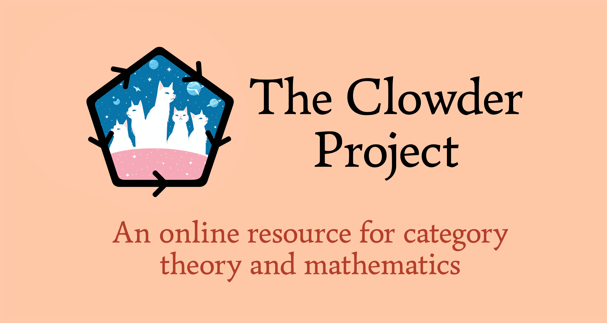

# The Clowder Project
<p align="center"></p>
<p>This is the repository for the <a href="https://topological-modular-forms.github.io/the-clowder-project">Clowder Project</a>, an online resource for category theory and related mathematics.</p>

## Requirements
This project uses [conda](https://anaconda.org/anaconda/conda) due to Gerby requiring python3.6.

## Initial Setup
First, clone the repository via
```
git clone https://github.com/The-Clowder-Project/the-clowder-project
```
Then, run `conda-create`, activate the new conda environment via `conda activate clowder_py_36env`, and then run `make init`, which will install all required dependencies.

## Building the PDFs
The PDFs can be built by running `make all`. There are also `make` commands for particular styles, which are formatted as follows:
- `make [style]` to build the book PDFs.
- `make tags-[style]` to build the tagged book PDFs.
- `make chapters-[style]` to build all chapters individually.
- `make tags-chapters-[style]` to build all tagged chapters individually.
The available styles are: `cm` (Computer Modern), `alegreya` (Alegreya), `alegreya-sans` (Alegreya Sans), `alegreya-sans-tcb` (Alegreya Sans with `tcbthm` replacing `amsthm`), `crimson-pro`, `eb-garamond`, and `xcharter`.

The default style in the [Clowder website](https://www.clowderproject.com) is `alegreya-sans-tcb`.
## Building the Web Version
To build and serve the website on localhost, run `make web-and-serve`.
